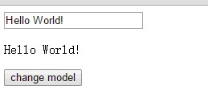

# 结课作业提交仓库

姓名：王骁
学校：南京大学
专业：软件工程
年级：2020级
QQ：1574019603

# 前言

本项目是一个简易的MVVM框架，主要目的是实现**v-model**的双向绑定和**v-bind**的单向绑定

# 1.使用

首先在项目终端运行tsc -w，编译ts文件


然后创建html后

```javascript
<script src="src/Watcher.js"></script>
<script src="src/Observer.js"></script>
<script src="src/Compile.js"></script>
<script src="src/MVVM.js"></script>
```

添加以上依赖后，即可创建MVVM对象

例如:

```javascript
let vm = new MVVM({
    el:'#app',
    data:{
        message:{
            tx:'sm',
            tx2:'smm'
        },
        a:1,
        b:'sssm',
    }
})
```


**demo.html**中有以下模块

```
<div id = "app">
    <input type="text" v-model = "message.tx">
    <div>{{message.tx}}</div>
    <ul><li></li></ul>
    <input type="text" v-bind = "message.tx">
    {{a}}
</div>
```

可以通过**v-model**和**v-bind**分别实现双向和单向绑定

此外还有**{{}}**,类比vue.js


效果图




# 2.检查点

## 2.1数据劫持

如图，在**Observer.ts**中实现了数据劫持


## 2.2发布订阅模式

如图，在**Observer.ts**中实现Dep类以实现数据劫持


## 2.3数据单向绑定

如图，第三个输入框使用v-bind时，data的变化会引起输入框内容的变化


但改变输入框的值时不会改变data


## 2.4双向绑定

见使用中示例gif


## 2.5项目要求

### 2.5.1readme

### 2.5.2使用TypeScript

见项目使用typescript开发

### 2.5.3单测

根目录中test文件夹中进行单元测试，分别测试Compile、Watcher、Observer中部分方法


